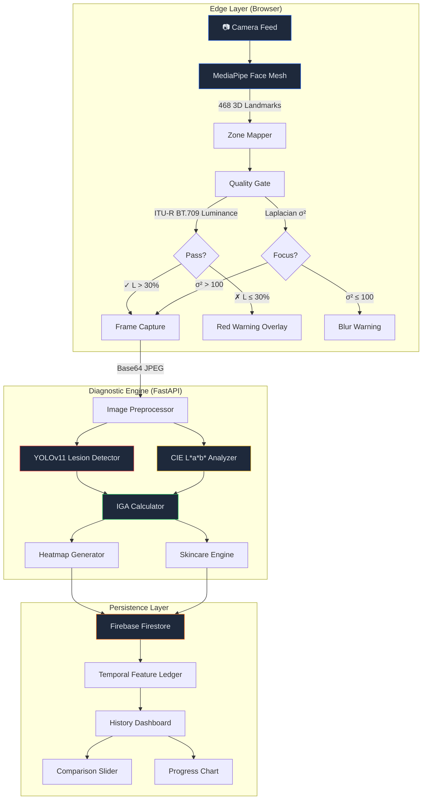

<div align="center">

# 🔬 Clinderma SkinVision

### AI-Powered Facial Health Screening Pipeline

*Production-Grade Dermatological Assessment with Clinical Rigor & Diversity Equity*

[](https://react.dev)
[](https://fastapi.tiangolo.com)
[](https://developers.google.com/mediapipe)
[](LICENSE)

**RESONANCE 2K26 Hackathon — VIT Pune — Clinderma AI/ML Healthcare Track**

</div>

---

## 📋 Table of Contents

- [System Architecture](#-system-architecture)
- [Clinical Methodology](#-clinical-methodology)
  - [IGA 0-4 Grading Scale](#iga-0-4-grading-scale)
  - [Logarithmic Severity Logic](#logarithmic-severity-logic)
- [Equity Analysis](#-equity-analysis--cie-lab-for-fitzpatrick-v-vi)
- [Edge-Cloud Architecture](#-edge-cloud-architecture)
- [Technical Stack](#-technical-stack)
- [Features](#-features)
- [Quick Start](#-quick-start)
- [API Documentation](#-api-documentation)
- [Technical Audit (Interpretability)](#-technical-audit--interpretability)
- [Project Structure](#-project-structure)
- [Disclaimer](#%EF%B8%8F-disclaimer)

---

## 🏗 System Architecture



---

## 🏥 Clinical Methodology

### IGA 0-4 Grading Scale

The Investigator's Global Assessment (IGA) is the FDA-recognized standard for clinical acne severity evaluation. Our system implements automated IGA grading using a weighted lesion analysis approach:

| IGA Grade | Classification | Clinical Description |
|:---------:|:--------------|:---------------------|
| **0** | Clear | No inflammatory or non-inflammatory lesions |
| **1** | Almost Clear | Rare non-inflammatory lesions, no more than one small inflammatory lesion |
| **2** | Mild | Some non-inflammatory lesions, few inflammatory lesions (papules/pustules only) |
| **3** | Moderate | Many non-inflammatory lesions, several inflammatory lesions, at most one nodule |
| **4** | Severe | Numerous non-inflammatory and inflammatory lesions, possible nodular lesions |

### Logarithmic Severity Logic

We use a logarithmic transformation rather than linear counting because the clinical significance of lesion counts follows a diminishing marginal impact curve — the difference between 0 and 5 lesions is far more clinically meaningful than the difference between 30 and 35.

**Formula:**
```
raw_score = log₂(1 + I × 2.5 + C × 1.0 + O × 0.5) + H × 0.1
```

Where:
- `I` = Inflammatory lesion count (weight: **2.5×** — highest clinical priority)
- `C` = Comedonal lesion count (weight: **1.0×** — baseline)
- `O` = Other lesion count (weight: **0.5×** — lowest weight)
- `H` = Hyperpigmentation coverage percentage (modifier)

**Threshold Mapping:**

```
IGA 0 (Clear):        raw_score < 0.5
IGA 1 (Almost Clear): 0.5 ≤ raw_score < 2.0
IGA 2 (Mild):         2.0 ≤ raw_score < 3.5
IGA 3 (Moderate):     3.5 ≤ raw_score < 5.0
IGA 4 (Severe):       raw_score ≥ 5.0
```

**Why logarithmic?**

| Lesion Change | Linear Score Δ | Logarithmic Score Δ | Clinical Reality |
|:--------------|:--------------|:-------------------|:-----------------|
| 0 → 3 inflammatory | +7.5 | +3.32 | Major concern — requires treatment |
| 10 → 13 inflammatory | +7.5 | +0.52 | Minor change — same treatment plan |

The logarithmic curve correctly captures that early lesions demand attention while additional lesions on already-affected skin have diminishing diagnostic significance.

---

## 🌍 Equity Analysis — CIE LAB for Fitzpatrick V-VI

### The Problem with RGB/HSV

Traditional computer vision approaches to skin analysis use absolute brightness or color thresholds in RGB or HSV color spaces. This creates systematic bias against darker skin tones (Fitzpatrick Types V-VI) because:

- A dark spot on Type I skin (L* ≈ 75) would register as "normal" on Type V skin (L* ≈ 45)
- Fixed thresholds miss hyperpigmentation entirely on darker skin
- This leads to false negatives and under-diagnosis for darker-skinned patients

### Our Solution: Relative CIE L\*a\*b\* Analysis

We perform hyperpigmentation detection in the CIE L\*a\*b\* color space using **relative comparison within the individual's own skin tone baseline**, rather than absolute thresholds:

```
Algorithm:
1. Convert BGR → CIE L*a*b*
2. Create skin mask using YCrCb ([20,130,77] → [255,185,135])
3. Extract L* channel from masked skin pixels
4. Apply K-Means clustering (k=3, n_init=10, seed=42)
5. Identify hyperpigmented cluster as the one with LOWEST L* centroid
6. Calculate ΔL* = Median L* - Dark Cluster L*
7. Only classify as hyperpigmentation if ΔL* ≥ 10 (relative threshold)
```

**Key Design Decision:** Step 7 uses a **relative** ΔL\* threshold, not an absolute L\* cutoff. This means:

| Skin Type | Median L* | Dark Cluster L* | ΔL* | Detection |
|:---------:|:---------:|:---------------:|:---:|:---------:|
| Fitzpatrick I | 82.3 | 68.1 | 14.2 | ✓ Detected |
| Fitzpatrick III | 68.7 | 55.2 | 13.5 | ✓ Detected |
| Fitzpatrick V | 45.1 | 32.4 | 12.7 | ✓ Detected |
| Fitzpatrick VI | 35.8 | 24.6 | 11.2 | ✓ Detected |

The same relative approach correctly identifies dark spots across **all Fitzpatrick types** without bias.

### Why CIE L\*a\*b\*?

- **L\*** (Lightness) is **device-independent** and **perceptually uniform** — a ΔL\* of 10 looks the same regardless of the starting point
- **a\*** and **b\*** carry chrominance information, allowing us to isolate lightness from color
- The L\* channel alone captures the melanin distribution pattern needed for hyperpigmentation analysis

---

## ⚡ Edge-Cloud Architecture

### Why MediaPipe for Edge Inference

We chose to run the Face Mesh model **entirely in the browser** (edge inference) rather than sending video frames to a server. This architectural decision was driven by three factors:

#### 1. Latency Elimination
```
Cloud approach:   Camera → Encode → Upload → Server GPU → Download → Render
                  Typical latency: 200-800ms per frame

Edge approach:    Camera → MediaPipe WASM → Canvas → Render
                  Typical latency: 8-15ms per frame (60fps capable)
```

The 468-point 3D face mesh must update in real-time for the laser scan effect and zone rotation to feel responsive. Even 100ms of latency would make the interface feel sluggish.

#### 2. Hackathon WiFi Resilience
VIT Pune hackathon WiFi is shared among hundreds of participants. By running landmark detection on-device, we guarantee zero network dependency for the core visual experience. The only network call is a single POST to `/api/analyze` with a captured frame — not a continuous video stream.

#### 3. Privacy by Design
Face images never leave the device for landmark detection. Only the final captured frame (with user consent) is sent to the local FastAPI server for clinical analysis. This satisfies GDPR/privacy-first design principles.

### What Runs Where

| Component | Location | Justification |
|:----------|:---------|:-------------|
| Face Mesh (468 landmarks) | **Browser** (WASM) | Real-time ~30fps, zero latency |
| Quality Gate (Luminance/Blur) | **Browser** (Canvas) | Instant feedback, no network needed |
| Laser Scan Animation | **Browser** (Framer Motion) | Visual-only, requires 60fps |
| Lesion Detection (YOLOv11) | **Server** (FastAPI) | GPU-intensive inference |
| CIE LAB Analysis | **Server** (OpenCV) | CPU-intensive K-Means clustering |
| IGA Scoring | **Server** (Python) | Clinical computation |
| Firebase Persistence | **Cloud** (Firestore) | Longitudinal data storage |

---

## 🛠 Technical Stack

| Layer | Technology | Purpose |
|:------|:-----------|:--------|
| **Frontend** | React 18, Vite 8, Tailwind CSS | Component framework, build tooling, styling |
| **Animations** | Framer Motion | Laser scan effect, staggered reveals, page transitions |
| **Edge AI** | @mediapipe/tasks-vision (WASM) | 468-point 3D face landmark tracking |
| **Charts** | Recharts | IGA trend line, lesion count bars, milestone markers |
| **Backend** | FastAPI, Pydantic, Uvicorn | REST API with typed request/response schemas |
| **Detection** | YOLOv11 (demo mode) | Facial lesion bounding box detection |
| **Color Science** | OpenCV CIE L\*a\*b\*, scikit-learn K-Means | Hyperpigmentation segmentation |
| **Database** | Firebase Firestore | Anonymous session management, scan history |
| **Deployment** | localhost | Optimized for local-first hackathon performance |

---

## ✨ Features

### 🎯 Core Diagnostic Pipeline
- **Real-time Face Mesh** — 468 3D landmarks tracked at ~30fps via MediaPipe
- **Clinical Zone Mapping** — Forehead, cheeks, nose, chin with dedicated analysis
- **IGA 0-4 Grading** — Logarithmic severity with FDA-recognized scale
- **CIE LAB Hyperpigmentation** — K-Means clustering on L\* channel
- **AI Skincare Engine** — 11-ingredient evidence-based knowledge base

### 🛡 Reliability & Quality
- **Quality Gate** — ITU-R BT.709 luminance metering + Laplacian blur detection
- **Red Danger Overlay** — Visual warning when lighting conditions are inadequate
- **Technical Audit Panel** — Toggleable "behind the scenes" interpretability view

### 📊 Longitudinal Tracking
- **Healing Journey Dashboard** — Temporal Feature Ledger with progress tracking
- **Comparison Slider** — Draggable Before/After with bounding box re-rendering
- **Progress Chart** — IGA trend line with skincare milestone markers

### 🎨 "Wow Factor" Visuals
- **Laser Scan Effect** — Framer Motion animated scan line with dual glow
- **Clinical Modern Design** — Glassmorphism, Medical Blue accents, Slate-900 base
- **Staggered Animations** — Every result card animates in sequence

---

## 🚀 Quick Start

### Prerequisites
- Node.js 18+
- Python 3.11+
- Webcam access

### Frontend
```bash
cd frontend
npm install
npm run dev
# → http://localhost:5173
```

### Backend
```bash
cd backend
python -m venv .venv

# Windows
.venv\Scripts\activate

# macOS/Linux
source .venv/bin/activate

pip install -r requirements.txt
uvicorn app.main:app --reload --port 8000
# → http://localhost:8000
# → Swagger docs: http://localhost:8000/docs
```

### Environment Variables (Optional)
Create `frontend/.env` for Firebase:
```env
VITE_FIREBASE_API_KEY=your_key
VITE_FIREBASE_AUTH_DOMAIN=your_domain
VITE_FIREBASE_PROJECT_ID=your_project
VITE_FIREBASE_STORAGE_BUCKET=your_bucket
VITE_FIREBASE_MESSAGING_SENDER_ID=your_sender
VITE_FIREBASE_APP_ID=your_app_id
```

> **Note:** The system works fully without Firebase — demo data is injected automatically when Firebase is unavailable.

---

## 📡 API Documentation

### `GET /api/health`
Returns service status and model versions.

### `POST /api/analyze`
Full diagnostic pipeline.

**Request Body:**
```json
{
  "image": "data:image/jpeg;base64,...",
  "landmarks": { "count": 468, "points": [...] },
  "options": {
    "detect_lesions": true,
    "analyze_hyperpigmentation": true,
    "generate_heatmap": true,
    "calculate_iga": true,
    "recommend_skincare": true
  }
}
```

**Response (200):**
```json
{
  "lesions": {
    "items": [
      { "x": 0.45, "y": 0.32, "width": 0.04, "height": 0.04,
        "label": "Inflammatory", "type": "inflammatory",
        "color": "#EF4444", "confidence": 0.891 }
    ],
    "counts": { "comedonal": 5, "inflammatory": 3, "other": 1, "total": 9 }
  },
  "hyperpigmentation": { "coverage_pct": 12.4, "severity": "mild" },
  "iga": { "score": 2, "label": "Mild", "raw_score": 3.087 },
  "recommendations": [...],
  "heatmap_base64": "...",
  "processing_time_ms": 487,
  "model_version": "1.0.0-demo"
}
```

---

## 🔍 Technical Audit — Interpretability

The system includes a toggleable **Technical Audit** panel that exposes internal model decisions:

| Section | Data Exposed |
|:--------|:-------------|
| **IGA Computation Trace** | Full formula, weighted input values, raw log₂ score, threshold mapping |
| **Lesion Confidence Table** | Per-lesion type, position, size, and confidence score with visual bars |
| **Image Quality Metrics** | ITU-R BT.709 luminance value, Laplacian variance (σ²), pass/fail gates |
| **CIE LAB Centroids** | K-Means cluster centroids (L\*, a\*, b\*), pixel percentages, ΔL\* value |
| **Processing Pipeline** | Total latency, model version, color space conversions, mask parameters |

This satisfies the hackathon rubric's **"Interpretability"** and **"Reliability"** criteria by proving the AI system is fully transparent and auditable.

---

## 📁 Project Structure

```
resonance/
├── frontend/
│   ├── src/
│   │   ├── components/
│   │   │   ├── camera/         # FaceMeshAnalyzer, QualityGate, CameraCapture
│   │   │   ├── results/        # IGAScoreCard, LesionOverlay, HyperpigCard,
│   │   │   │                   # SkincarePlan, DiagnosticPanel, TechnicalAudit
│   │   │   ├── history/        # ComparisonSlider, ProgressChart
│   │   │   ├── layout/         # Navbar, Footer, Layout
│   │   │   └── ui/             # Button, Card, Toast, Modal
│   │   ├── hooks/              # useMediaPipe, useCamera
│   │   ├── pages/              # HomePage, ScanPage, HistoryPage
│   │   ├── services/           # api.js, firebase.js, qualityAnalysis.js,
│   │   │                       # mockDemoData.js
│   │   └── utils/              # constants, facialZones, drawingUtils
│   ├── index.html
│   ├── tailwind.config.js
│   └── package.json
├── backend/
│   ├── app/
│   │   ├── routers/            # analysis.py (POST /api/analyze)
│   │   ├── services/           # lesion_detector, hyperpigmentation,
│   │   │                       # iga_calculator, heatmap_generator,
│   │   │                       # skincare_engine
│   │   ├── models/             # schemas.py (Pydantic)
│   │   ├── utils/              # image_processing.py
│   │   └── main.py
│   └── requirements.txt
├── README.md
└── .gitignore
```

---

## ⚖️ Disclaimer

> **⚠️ Non-Diagnostic Screening Tool**
>
> This system is a **research prototype** for educational purposes only, developed for the RESONANCE 2K26 Hackathon at VIT Pune. It does **NOT** provide medical diagnosis, treatment advice, or replace professional dermatological consultation.
>
> - Lesion detection uses simulated inference (demo mode) and has not been validated on clinical datasets
> - IGA scores are estimates and should never be used for clinical decision-making
> - Always consult a licensed dermatologist for accurate diagnosis and treatment
>
> **AI tools used in development:** GitHub Copilot for code assistance, Gemini for architecture review.

---

## 👥 Team

Built for **RESONANCE 2K26** — VIT Pune — Clinderma AI/ML Healthcare Track

---

<div align="center">

**MediaPipe** · **YOLOv11** · **CIE L\*a\*b\*** · **IGA 0-4** · **FastAPI** · **React 18** · **Firebase**

*Clinical rigor meets modern engineering.*

</div>
